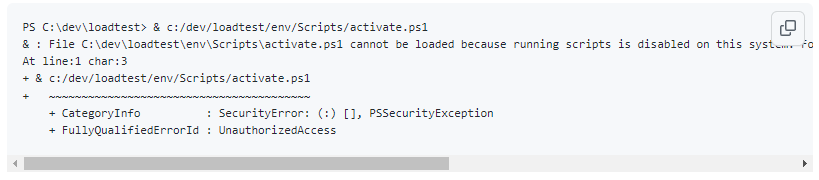
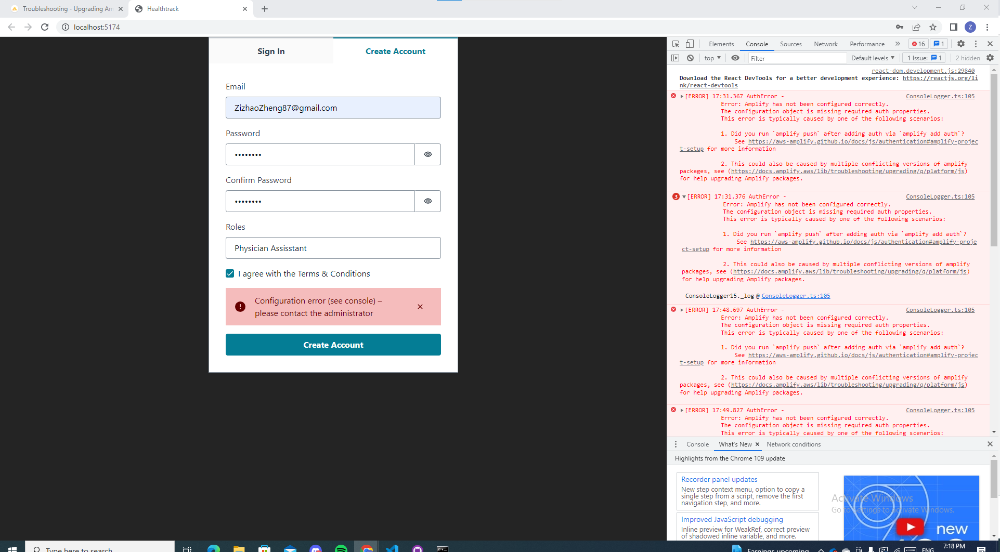

# HealthtrackV8

## Amplify updates
```sh
rm -r amplify
rm -r src/graphql
rm -r src/ui-components
rm src/API.ts src/aws-exports.js

amplify pull --appId dd1gmnh1dmpn6 --envName iv
amplify codegen
amplify codegen models
```

## Naming Convention

Examples
- Features: `feature/add-admin-button-to-panel`
- Refactor: `refactor/admin-panel/nurse-to-admin`
- Fix: `fix/removed-annoying-alert-button`


## Installation

Clone the front and backend project

*Please don't create a folder to git clone. Just clone repo to path. such as charlie's directory structure: C:\Users\kenzh\Work,*
```bash
git clone https://github.com/Dotechno/HealthtrackV8
cd HealthtrackV8

```

*Please when you amplify pull into folder, please amplify to HealthTracker V8 folder*
```bash
amplify pull --appId dd1gmnh1dmpn6 --envName dev
```

Install yarn and run a dev server
```
npm install --global yarn
yarn install
yarn start
```

## Deployment FAQ
### Vscode not running script disable:


### Solution: [Reference](https://github.com/Microsoft/vscode-python/issues/2559)
  1. open window powershell
  2. `Set-ExecutionPolicy -ExecutionPolicy RemoteSigned -Scope CurrentUser`
  3. `Get-ExecutionPolicy`
  4. `Get-ExecutionPolicy -LIST`

  

### Create an account:

Just put your email and strong Password generated from Google Chrome Password manager

If you have problem,

---------

### Error: Amplify has not been configure correctly.

        
### Solution: [Stackoverflow](https://stackoverflow.com/questions/63605779/autherror-error-amplify-has-not-been-configured-correctly#comment115783887_63605780)
    1. npm un aws-amplify @aws-amplify/ui-react
    2. npm i aws-amplify @aws-amplify/ui-react

# Documentations
## Change router settings
`router.tsx`: in nav and `<Routes>`

`index.tsx`: do it
